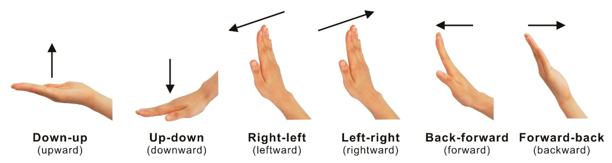

# Advanced Hand Gesture Recognition 🤖👋

[](https://www.python.org/downloads/)
[](https://opencv.org/)
[](https://mediapipe.dev/)
[](LICENSE)

Dự án nhận diện cử chỉ tay nâng cao với AI, điều khiển máy tính và ghi lại cử chỉ real-time sử dụng OpenCV và MediaPipe.

<div align="center">
  
  <p><em>Tổng quan các cử chỉ tay được hỗ trợ trong dự án</em></p>
</div>


## 📸 Demo


*Giao diện chính với nhận diện cử chỉ real-time*


*Điều khiển máy tính bằng cử chỉ tay*


*Thống kê và phân tích cử chỉ*

## ✨ Tính năng mới

### 🎯 Nhận diện cử chỉ nâng cao
- **Số từ 0-5**: Fist, Index, Peace, Three, Four, Open hand
- **Cử chỉ đặc biệt**: OK 👌, Thumbs up 👍, Rock 🤟, I love you ❤️
- **Chuyển động**: Swipe Left/Right/Up/Down, Wave
- **Hỗ trợ 2 tay** đồng thời

### 🎮 Điều khiển máy tính
- **Media**: Play/Pause, Next/Previous track
- **Âm lượng**: Volume Up/Down
- **Trình duyệt**: New tab, Close tab
- **Hệ thống**: Switch window, Show desktop, Screenshot
- **Scroll**: Cuộn lên/xuống trang web

### 📹 Ghi lại & Phát lại
- Ghi lại sequence cử chỉ
- Lưu vào file JSON với timestamp
- Phát lại và phân tích thống kê
- Xuất báo cáo chi tiết

### 📊 Thống kê Real-time
- Thời gian session
- Tổng số cử chỉ
- Tần suất cử chỉ/phút
- Cử chỉ phổ biến nhất

### 🎓 Training Mode
- Thu thập data để train custom gestures
- Chuẩn hóa landmarks
- Export training dataset

## 🚀 Chạy ứng dụng

### Phiên bản cơ bản
```bash
python main.py
```

### Phiên bản nâng cao (Khuyến nghị)
```bash
python advanced_main.py
```

### Training mode
```bash
python gesture_trainer.py
```

## ⌨️ Điều khiển

| Phím | Chức năng |
|------|-----------|
| **C** | Bật/tắt điều khiển máy tính |
| **R** | Bắt đầu/dừng ghi cử chỉ |
| **L** | Hiện/ẩn landmarks |
| **S** | Hiện/ẩn thống kê |
| **H** | Hiện/ẩn hướng dẫn |
| **Q** | Thoát |

## 🎮 Cử chỉ điều khiển

| Cử chỉ | Hành động |
|--------|-----------|
| 👍 Thumbs up | Tăng âm lượng |
| ✊ Fist (0) | Giảm âm lượng |
| ☝️ Index (1) | Play/Pause |
| ✌️ Peace (2) | Tab mới |
| 🤟 Three | Đóng tab |
| 🖐️ Four | Chuyển cửa sổ |
| ✋ Five | Hiện desktop |
| 👌 OK | Screenshot |
| ⬅️ Swipe Left | Bài trước |
| ➡️ Swipe Right | Bài tiếp |
| ⬆️ Swipe Up | Scroll lên |
| ⬇️ Swipe Down | Scroll xuống |

## 📁 Cấu trúc dự án

```
├── main.py                      # Phiên bản cơ bản
├── advanced_main.py             # Phiên bản nâng cao ⭐
├── gesture_detector.py          # Detector cơ bản
├── advanced_gesture_detector.py # Detector nâng cao
├── gesture_controller.py        # Điều khiển máy tính
├── gesture_recorder.py          # Ghi lại cử chỉ
├── gesture_trainer.py           # Training mode
├── recordings/                  # Thư mục lưu recordings
├── training_data/              # Thư mục training data
├── requirements.txt            # Dependencies
└── README.md                   # Hướng dẫn
```

## 🛠️ Công nghệ

- **OpenCV 4.8+**: Computer vision
- **MediaPipe 0.10+**: Hand tracking AI
- **PyAutoGUI**: System control
- **NumPy**: Mathematical operations
- **JSON**: Data serialization

## 📋 Cài đặt

```bash
# Clone project
git clone https://github.com/DYBInh2k5/Advanced-Hand-Gesture-Recognition.git
cd Advanced-Hand-Gesture-Recognition

# Cài đặt dependencies
pip install -r requirements.txt

# Chạy phiên bản nâng cao
python advanced_main.py
```

## 🎯 Sử dụng

1. **Khởi động**: Chạy `python advanced_main.py`
2. **Bật điều khiển**: Nhấn `C` để bật computer control
3. **Thực hiện cử chỉ**: Đưa tay vào camera và thử các cử chỉ
4. **Ghi lại**: Nhấn `R` để bắt đầu recording
5. **Xem thống kê**: Theo dõi stats real-time

## 🔧 Tùy chỉnh

- Điều chỉnh `action_cooldown` trong `gesture_controller.py`
- Thêm cử chỉ mới trong `advanced_gesture_detector.py`
- Tùy chỉnh UI colors trong `advanced_main.py`

## 🚨 Lưu ý

- Cần webcam để sử dụng
- Windows: Một số tính năng cần quyền admin
- Lighting: Ánh sáng tốt giúp nhận diện chính xác hơn
## 
🎬 Video Demo

Để tạo video demo:
```bash
python demo_screenshot.py
```

## 🤝 Contributing

1. Fork dự án
2. Tạo feature branch (`git checkout -b feature/AmazingFeature`)
3. Commit changes (`git commit -m 'Add some AmazingFeature'`)
4. Push to branch (`git push origin feature/AmazingFeature`)
5. Mở Pull Request

## 📄 License

Distributed under the MIT License. See `LICENSE` for more information.

## 👨‍💻 Author

**DYBInh2k5**
- GitHub: [@DYBInh2k5](https://github.com/DYBInh2k5)
- Repository: [Advanced-Hand-Gesture-Recognition](https://github.com/DYBInh2k5/Advanced-Hand-Gesture-Recognition)

## 🙏 Acknowledgments

- [MediaPipe](https://mediapipe.dev/) - Google's ML framework
- [OpenCV](https://opencv.org/) - Computer Vision library
- [PyAutoGUI](https://pyautogui.readthedocs.io/) - GUI automation

## ⭐ Star History

[](https://star-history.com/#DYBInh2k5/Advanced-Hand-Gesture-Recognition&Date)

---

<div align="center">
  <strong>🌟 Nếu dự án hữu ích, hãy cho một star! 🌟</strong>
</div>